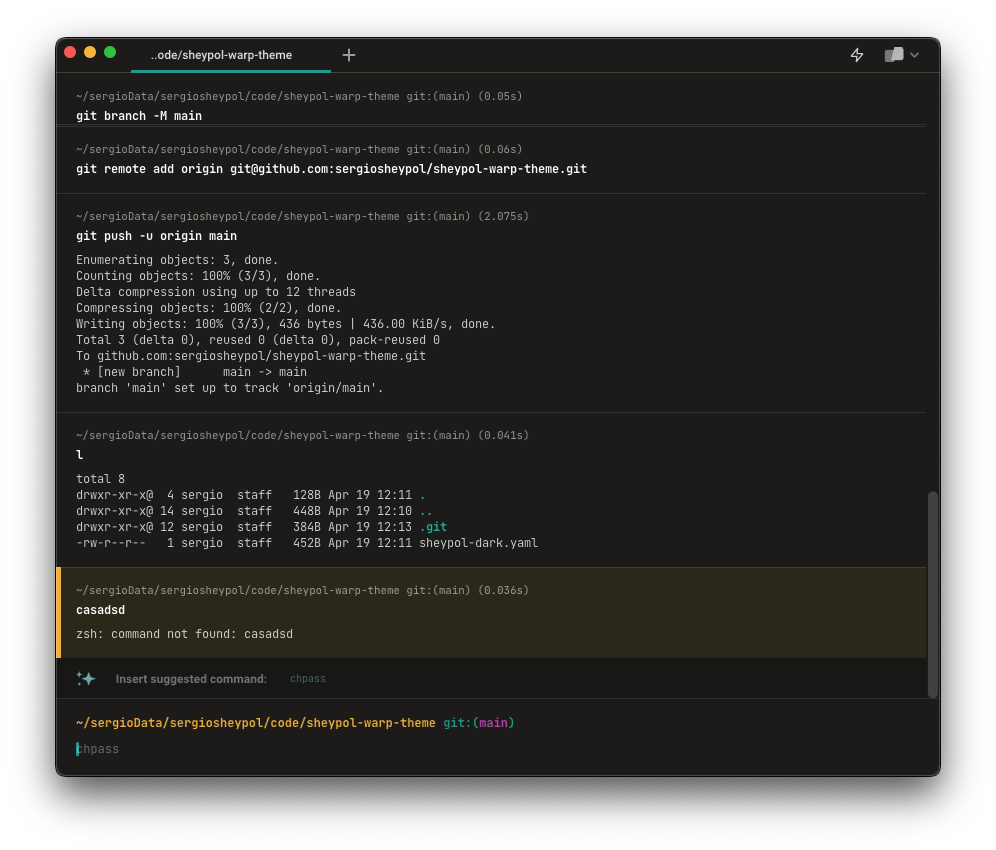

# Sheypol Warp Theme

I've created this cool Warp theme that matches my color palette. 

# How to install
Check the [official docs](https://docs.warp.dev/appearance/custom-themes#how-do-i-use-a-custom-theme-in-warp)

# Support

💪 follow me on [Github](https://github.com/sergiosheypol), [Tiktok](https://www.tiktok.com/@sergiosheypol)
or [Youtube](https://youtube.com/@sergiosheypol)

# Website

Check my website [sergiosheypol.dev](https://sergiosheypol.dev)

